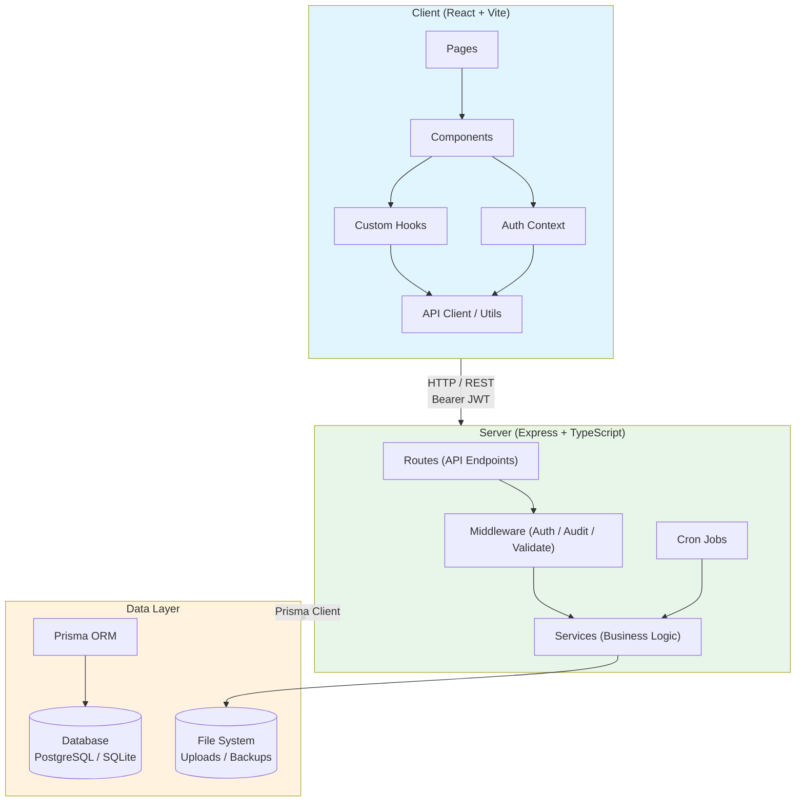
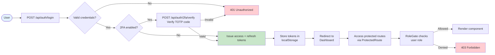
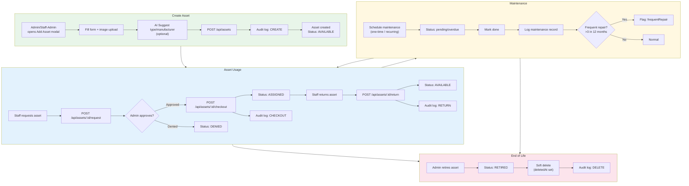
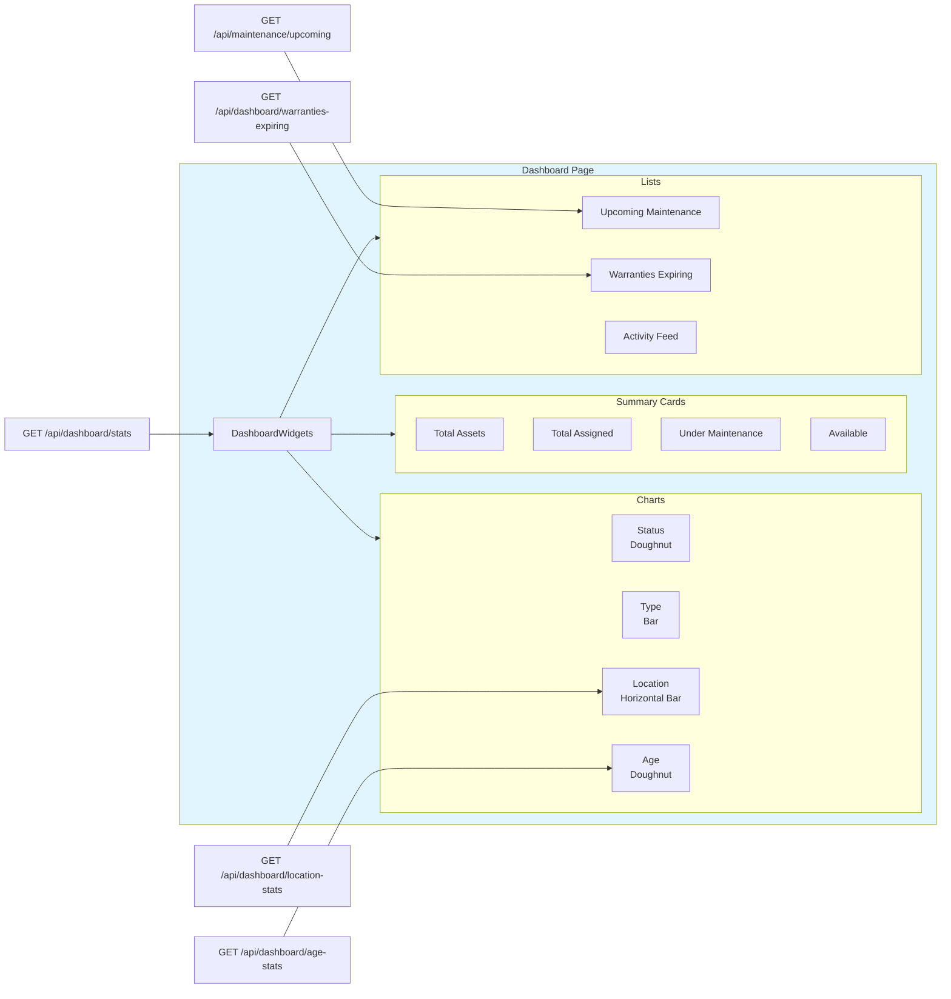
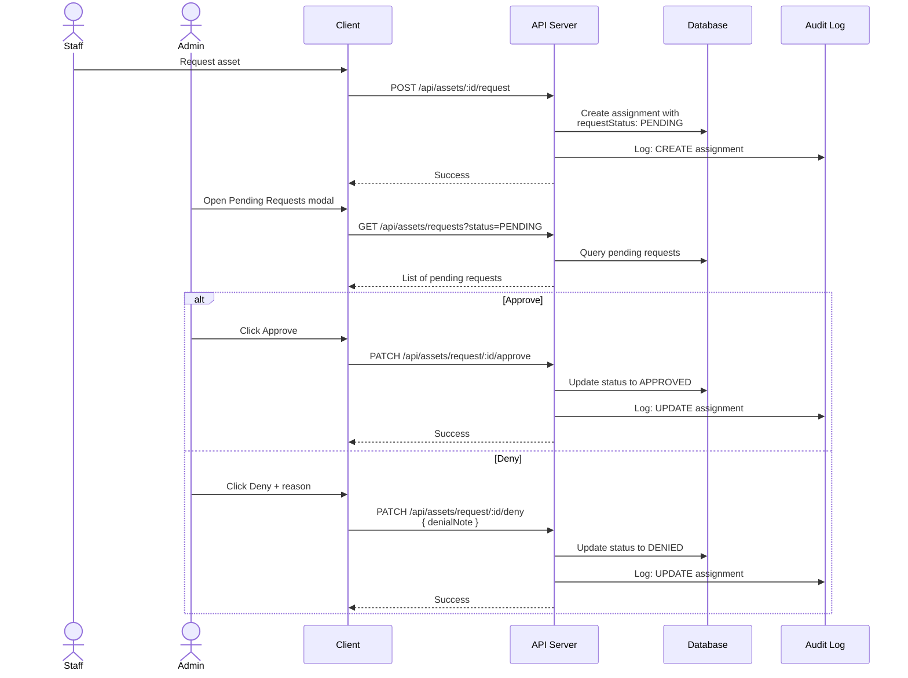
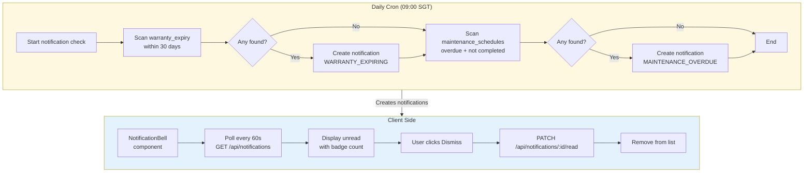
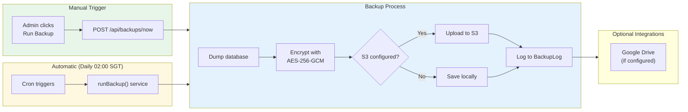
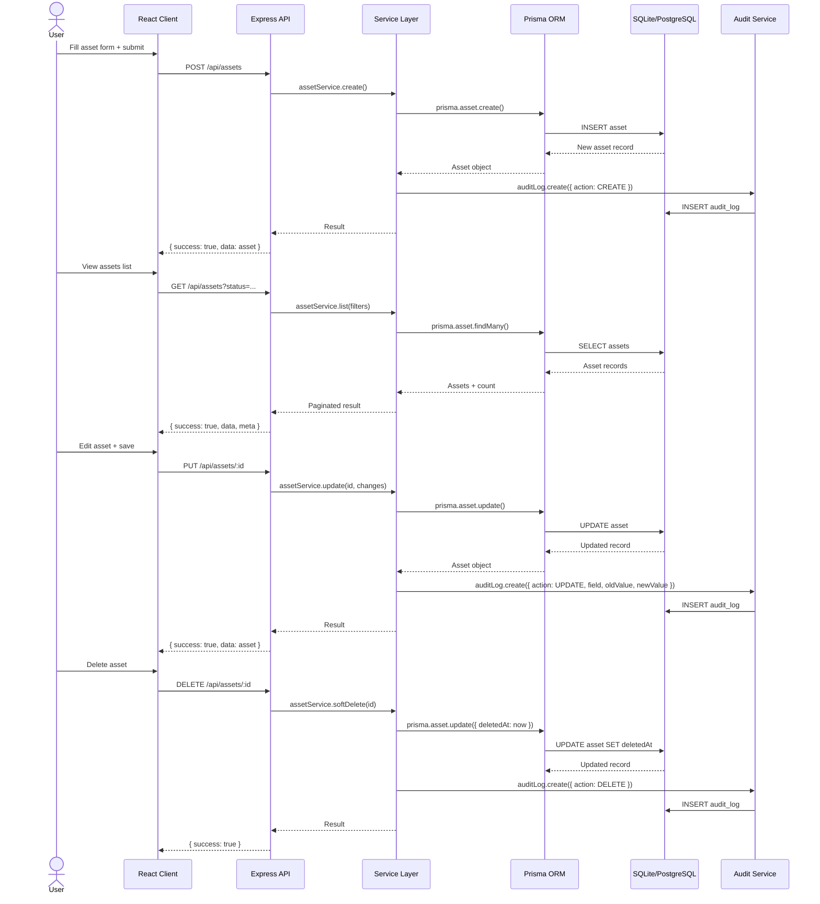
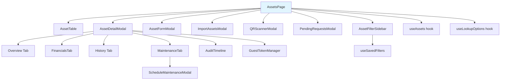
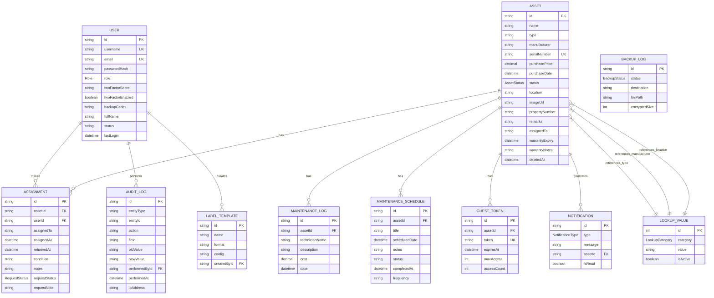

# AIO-System — Application Flow Chart

> Generated: 2026-04-24
> Format: Mermaid diagrams

---

## 1. System Architecture Overview

---

## 2. Authentication Flow

---

## 3. Asset Lifecycle Flow

---

## 4. Dashboard Data Flow

---

## 5. Request / Approval Workflow

---

## 6. Maintenance Notification Flow

---

## 7. Backup Flow

---

## 8. Data Flow — Asset CRUD with Audit

---

## 9. Component Hierarchy — Asset Page

---

## 10. Database Entity Relationships

---

## Legend

| Color | Meaning |
|-------|---------|
| 🟦 Light Blue | Client / UI |
| 🟩 Light Green | Success / Create operations |
| 🟨 Light Yellow | Cron / Scheduled jobs |
| 🟧 Light Orange | Data / Database |
| 🟥 Light Red | Error / Deny / End of life |

---

*End of flow chart documentation*
